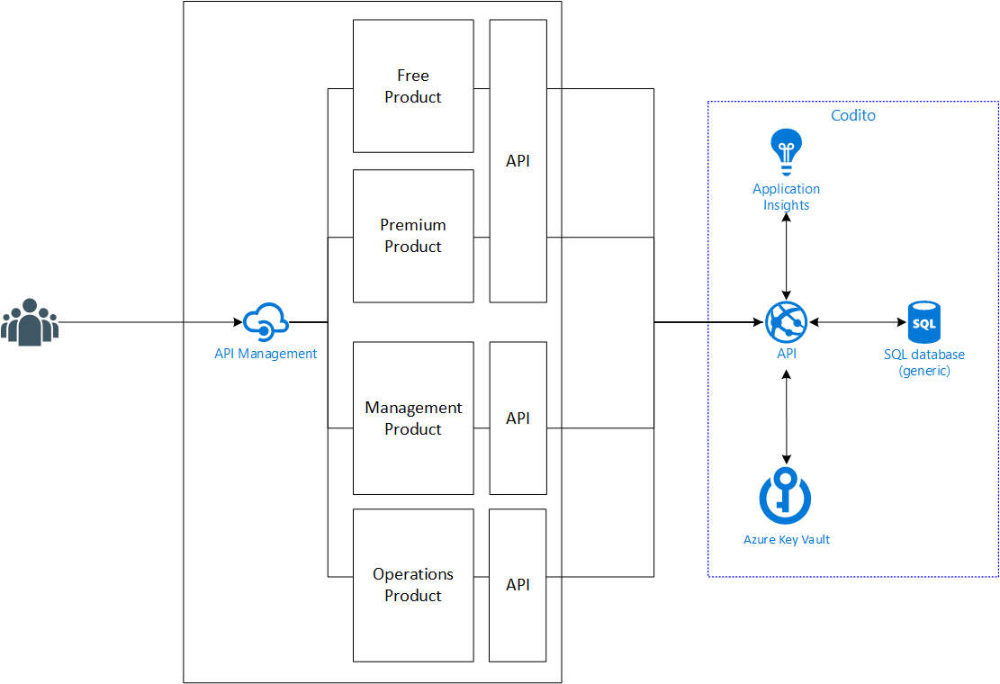

# Sello

 

Sello is a fictious company that is running a multi-tenant SaaS platform for selling products.

Everything is deployed automatically on a per-tenant level and is backed by Visual Studio Team Services Release Management

## API Overview
Sello exposes all their APIs via API Management in order to decouple the physical API from the endpoints that their customers are using.

This also enables them to only expose the APIs that 3rd parties need and keep the management APIs internally.

In Azure API Management we have the following setup:
- Product: "Sello"
    - Apis: "Sello API"
- Product: "Sello Management"
    - Apis: "Sello API" & "Sello Management API"

These will communicate with the physical API that is hosted in an Azure Web App.

|:rotating_light: **Security**                                                                        |
|-----------------------------------------------------------------------------------------------------|
| For the sake of the demo there are some gaps in API security:<ul><li>Physical API has no authentication and authorization</li><li>Physical API is publically reachable</li><li>No security between Azure API Management & the physical API</li></ul>This is not safe for production workloads and thus not recommended.|

## License Information
This is licensed under The MIT License (MIT). Which means that you can use, copy, modify, merge, publish, distribute, sublicense, and/or sell copies of the web application. But you always need to state that Codit is the original author of this web application.