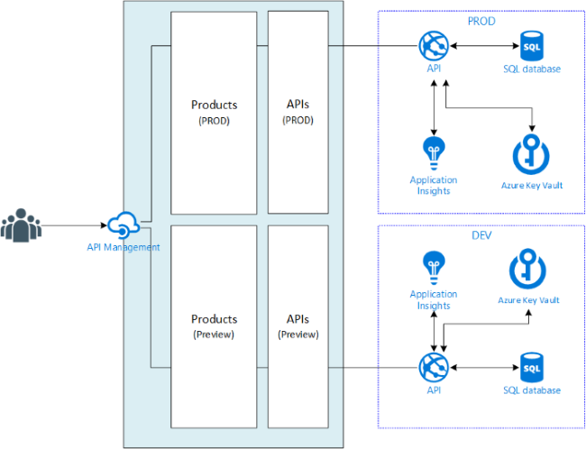

# Sello
Sello is a fictious company that is running a multi-tenant SaaS platform for selling products.

Everything is deployed automatically on a per-tenant level and is backed by Visual Studio Team Services Release Management

